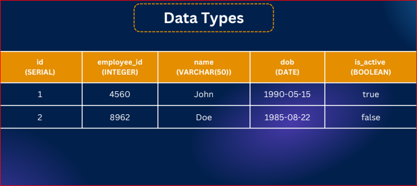
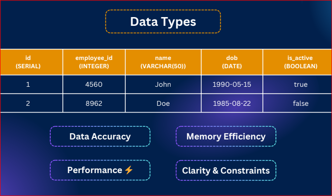

# slide - 3
https://drive.google.com/file/d/1ZQn4Q4DG9UyybOYUdY8USEFBTb0xo2DL

In this module, you’ll learn the fundamentals of PostgreSQL. From installing tools like pgAdmin and Beekeeper Studio to understanding key data types (Integer, Boolean, Character, Date, UUID), you’ll build a strong base. You’ll also practice creating and dropping databases/tables, applying constraints, and exploring different insert methods.

By the end, you’ll be ready to structure and manage data confidently in PostgreSQL.

## 44-1 intro to SQL
- The language we use to talk with databases - aka  Structured Query Language
- We wil use postgres and communicate using sql
- SQL Is declarative languageYou tell the database what you want, not how to do it. (database will manage it)
- lets see a sql statement

```
SELECT name FROM students WHERE age > 18 
```
- Tell step by step is `Imparative` but SQL is `declarative`
### SQL commnads category 
- Data Definition Language : CREATE, DROP, ALTER TRUNCATE
- Data Manipulation Language : INSERT, UPDATE, DELETE
- Data Query Language : SELECT
- Data Control Language : GRANT, REVOKE
- Transaction Control : COMMIT, ROLLBACK
- So, SQL is a declarative language to interact with databases. It’s old but gold, and still the backbone of all modern data systems
- It’s also powering the future with AI

## 44-2 
- pgAdmin not nessesary
## 44-3 
- install beekeepar.studio
## 44-4
- why need data type because of 
1. Data Acuuracy
2. Perfomance
3. Memory Efficiency
4. Clarity and constraints

# Data types
1. Boolean 
2. numbers
3. Date/time
4. Character
5. UUID

1. Boolean
true
false
null
2. Number / Int
Small Int (int2)
Storage : 2 bytes
Range : -32,768 to +32,767
Use case : Small numbers (like age,quantity)
### Integer (int4)
- Storage : 4 bytes
- Range : ~ -2B to +2B
- Use case : Default choice for whole numbers
### Bigint (int8)
- Storage : 8 bytes
 - Range : ~ -9 quintillion to +9 quintillion
- Use case : Very large numbers (IDs,counters)
### Real (float4)
-Storage : 4 bytes
- Range : ~6 decimal digits precision
- Use case : Approximate values (e.g.,sensor data)
### DOUBLE PRECISION (float8)
- Storage : 4 bytes
- Range : ~15 decimal digits precision
- Use case : Higher precision calculations
### NUMERIC / DECIMAL
- Storage : variable
- Range : User-defined precision (exact)
- Use case : Money, financial calculations
### SERIAL
- Storage : 4 bytes (auto-increment integer)
- Range : 1 to 2,147,483,647
 - Use case : Auto-incrementing IDs, primary keys

